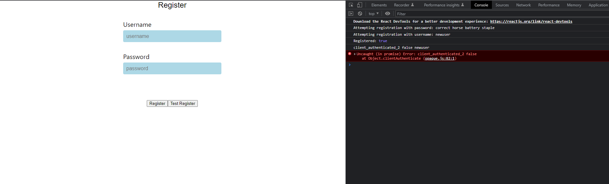

# Getting Started

This project runs and displays a simple register screen. The TestRegister button creates an API call of testClientRegister from clientRegister.ts and runs a test on registration, authentication on both clients and dummy server located in test-io.js

# Current Problems

Running testClientRegister, successfully registers a user, however, fails to pass line 79 of opaque.js, as the result returns true, however sometimes it returns false, possibly due to a logic error in the protocol, or clientAuthenticate is run preemptively before waiting for an asynchronous function to finish and return.

## Available Scripts

In the project directory, you can run:

### `npm run start-frontend`

Runs the frontend directory of the app
